# Дипломный практикум в Yandex.Cloud
  * [Цели:](#цели)
  * [Этапы выполнения:](#этапы-выполнения)
     * [Создание облачной инфраструктуры](#создание-облачной-инфраструктуры)
     * [Создание Kubernetes кластера](#создание-kubernetes-кластера)
     * [Создание тестового приложения](#создание-тестового-приложения)
     * [Подготовка cистемы мониторинга и деплой приложения](#подготовка-cистемы-мониторинга-и-деплой-приложения)
     * [Установка и настройка CI/CD](#установка-и-настройка-cicd)
  * [Что необходимо для сдачи задания?](#что-необходимо-для-сдачи-задания)
  * [Как правильно задавать вопросы дипломному руководителю?](#как-правильно-задавать-вопросы-дипломному-руководителю)

**Перед началом работы над дипломным заданием изучите [Инструкция по экономии облачных ресурсов](https://github.com/netology-code/devops-materials/blob/master/cloudwork.MD).**

---
## Цели:

1. Подготовить облачную инфраструктуру на базе облачного провайдера Яндекс.Облако.
2. Запустить и сконфигурировать Kubernetes кластер.
3. Установить и настроить систему мониторинга.
4. Настроить и автоматизировать сборку тестового приложения с использованием Docker-контейнеров.
5. Настроить CI для автоматической сборки и тестирования.
6. Настроить CD для автоматического развёртывания приложения.

---
## Этапы выполнения:


### Создание облачной инфраструктуры

Для начала необходимо подготовить облачную инфраструктуру в ЯО при помощи [Terraform](https://www.terraform.io/).

Особенности выполнения:

- Бюджет купона ограничен, что следует иметь в виду при проектировании инфраструктуры и использовании ресурсов;
Для облачного k8s используйте региональный мастер(неотказоустойчивый). Для self-hosted k8s минимизируйте ресурсы ВМ и долю ЦПУ. В обоих вариантах используйте прерываемые ВМ для worker nodes.

Предварительная подготовка к установке и запуску Kubernetes кластера.

1. Создайте сервисный аккаунт, который будет в дальнейшем использоваться Terraform для работы с инфраструктурой с необходимыми и достаточными правами. Не стоит использовать права суперпользователя
2. Подготовьте [backend](https://developer.hashicorp.com/terraform/language/backend) для Terraform:  
   а. Рекомендуемый вариант: S3 bucket в созданном ЯО аккаунте(создание бакета через TF)

[Манифест создания bucket](./01-storage/backend.tf)

`Запускаю создание сервисного аккаунта для управления бакетом, статического ключа для него и самого бакета (не трогая остальную инфраструктуру -target):`
```
terraform init
terraform apply -target=yandex_iam_service_account.sa_storage 
```
`Создание ключа для сервисного аккаунта бакета:`
```
yc iam key create --service-account-name sa-storage-backend --output ~/.authorized_key_sa_storage.json
```
`Создание бакета:`
```
terraform apply -target=yandex_storage_bucket.tf_state
```
`Проверка текущего состояния:`
```
terraform state list
```
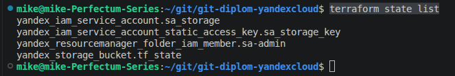

`Создать статический ключ сервисного аккаунта для доступа в backend:`
```
yc iam access-key create --service-account-name sa-storage-backend
```
`Передача ключей в Terraform через переменные окружения:`
```
export AWS_ACCESS_KEY_ID="мой_access_key"
export AWS_SECRET_ACCESS_KEY="мой_secret_key"
```
`Для сохранения ключей после закрытия сессии сохраняю их в ~/.bashrc. Однако безопаснее сохрананить их в ~/.aws/credentials:`
```
[default]
aws_access_key_id = мой_access_key
aws_secret_access_key = мой_secret_key
```

`Проверка ключей:`
```
env | grep AWS
```
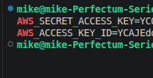

`Применение манифестов:`
```
terraform apply
```

   б. Альтернативный вариант:  [Terraform Cloud](https://app.terraform.io/)
3. Создайте конфигурацию Terrafrom, используя созданный бакет ранее как бекенд для хранения стейт файла. Конфигурации Terraform для создания сервисного аккаунта, бакета и основной инфраструктуры следует сохранить в разных папках.

`Проверить, что файл состояния действительно сохраняется в S3-бакете:`
```
yc storage s3api list-objects --bucket my-terraform-state-14051981
```
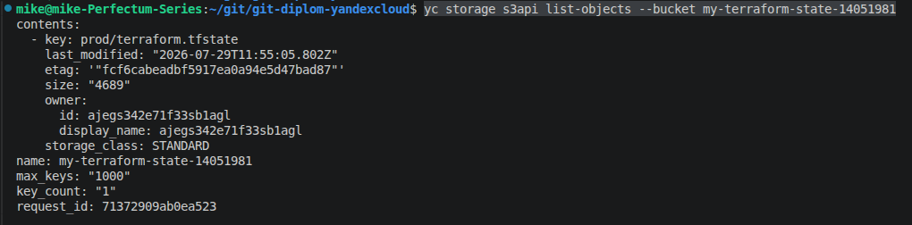

`Разнесу конфигурации по разным папкам, подправив манифесты`

`Импортирую уже созданный сервисный аккаунт в в папку 00-sa:`
```
cd ~/git/git-diplom-yandexcloud/00-sa
terraform import yandex_iam_service_account.sa_storage ajegs342e71f33sb1agl
```
`Проверка состояния:`
```
terraform state list
```

`Импорт бакета в папку 01-storage:`
```
cd ~/git/git-diplom-yandexcloud/01-storage
terraform import yandex_storage_bucket.tf_state my-terraform-state-14051981
```
`Проверка состояния:`
```
terraform state list
```
`Импорт основной инфраструктуры:`
```
cd ~/git/git-diplom-yandexcloud/02-infrastructure

```

4. Создайте VPC с подсетями в разных зонах доступности.

[Манифест создания VPC и подсетей](./02-infrastructure/networks.tf)

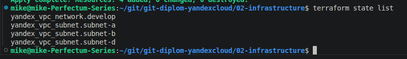

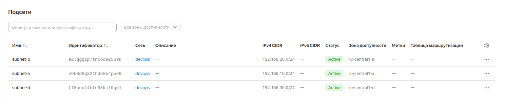

5. Убедитесь, что теперь вы можете выполнить команды `terraform destroy` и `terraform apply` без дополнительных ручных действий.
6. В случае использования [Terraform Cloud](https://app.terraform.io/) в качестве [backend](https://developer.hashicorp.com/terraform/language/backend) убедитесь, что применение изменений успешно проходит, используя web-интерфейс Terraform cloud.

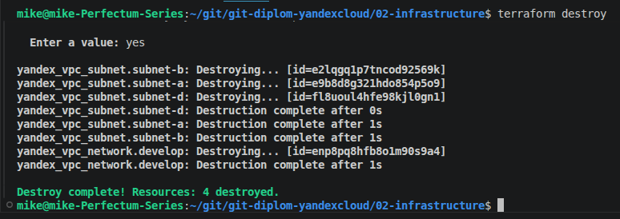

Ожидаемые результаты:

1. Terraform сконфигурирован и создание инфраструктуры посредством Terraform возможно без дополнительных ручных действий, стейт основной конфигурации сохраняется в бакете или Terraform Cloud
2. Полученная конфигурация инфраструктуры является предварительной, поэтому в ходе дальнейшего выполнения задания возможны изменения.

---
### Создание Kubernetes кластера

На этом этапе необходимо создать [Kubernetes](https://kubernetes.io/ru/docs/concepts/overview/what-is-kubernetes/) кластер на базе предварительно созданной инфраструктуры.   Требуется обеспечить доступ к ресурсам из Интернета.

Это можно сделать двумя способами:

1. Рекомендуемый вариант: самостоятельная установка Kubernetes кластера.  
   а. При помощи Terraform подготовить как минимум 3 виртуальных машины Compute Cloud для создания Kubernetes-кластера. Тип виртуальной машины следует выбрать самостоятельно с учётом требовании к производительности и стоимости. Если в дальнейшем поймете, что необходимо сменить тип инстанса, используйте Terraform для внесения изменений.  

`Создаю 3 VM для K8s-кластера в разных зонах: одну master-ноду со статическим публичным IP-адресом и две worker-ноды с приватными адресами. Все машины прерываемые:`

[Манифест создания виртуальных машин](./02-infrastructure/vms.tf)

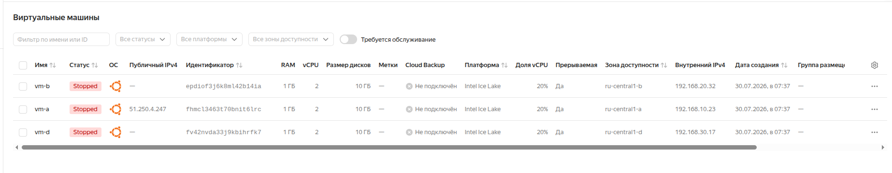

   б. Подготовить [ansible](https://www.ansible.com/) конфигурации, можно воспользоваться, например [Kubespray](https://kubernetes.io/docs/setup/production-environment/tools/kubespray/)

`Клонирую репозиторий Kubespray на локальную машину:`
```
git clone https://github.com/kubernetes-sigs/kubespray.git
cd kubespray
```
`Получить IP-адреса машин кластера для создания инвентаря:`
```
# Публичный IP мастер-ноды (vm-a)
yc compute instance get vm-a --format json | jq -r '.network_interfaces[0].primary_v4_address.one_to_one_nat.address'

# Внутренние IP воркеров (vm-b, vm-d)
yc compute instance get vm-b --format json | jq -r '.network_interfaces[0].primary_v4_address.address'
yc compute instance get vm-d --format json | jq -r '.network_interfaces[0].primary_v4_address.address'
```
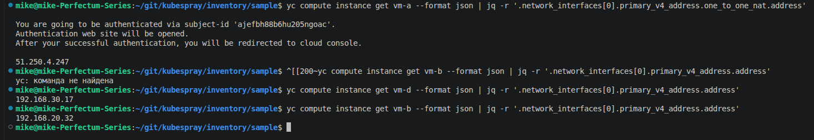

`Создать инвентарь на основе полученных IP-адресов машин:`
```
mkdir -p ~/git/kubespray/inventory/mycluster
nano hosts.yaml
```
[Файл инвентаря Ansible](./hosts.yaml)

`Проверка доступности машин:`
```
ansible -i inventory/mycluster/hosts.yaml all -m ping
```
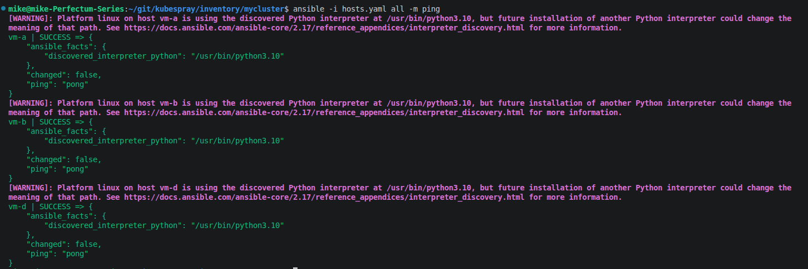

`Скопировать SSH-ключ на мастер-ноду:`
```
scp -i ~/.ssh/tf_ed25519 ~/.ssh/tf_ed25519 ubuntu@51.250.4.247:~/.ssh/
scp -i ~/.ssh/tf_ed25519 ~/.ssh/tf_ed25519.pub ubuntu@51.250.4.247:~/.ssh/
```

`Скопировать SSH-ключ на воркеры:`
```
# Подключиться к мастер-ноде:
ssh -i ~/.ssh/tf_ed25519 ubuntu@51.250.4.247

# Скопировать ключ на vm-b
ssh-copy-id -i ~/.ssh/tf_ed25519.pub ubuntu@192.168.20.32

# Скопировать ключ на vm-d
ssh-copy-id -i ~/.ssh/tf_ed25519.pub ubuntu@192.168.30.17

# Создайте ссылку, чтобы ключ был виден как стандартный
ln -sf ~/.ssh/tf_ed25519 ~/.ssh/id_ed25519
ln -sf ~/.ssh/tf_ed25519.pub ~/.ssh/id_ed25519.pub
```

`На master-node создать файл ~/.ssh/config, чтобы не пришлось указывать ключ для подключения к worker-nodes:`
```
Host 192.168.20.32
    IdentityFile ~/.ssh/tf_ed25519

Host 192.168.30.17
    IdentityFile ~/.ssh/tf_ed25519
```

`Версия Ansible >2.18 совместимая с Kubespray не доступна на Ubuntu 22.04. Поэтому запускаю Docker-контейнер с Kubespray на базе Ubuntu 24.04:`
```
# Запуск временного контейнера с монтированием SSH-ключей и SSH-агентом:
docker run --rm -it \
  -v $(pwd):/kubespray \
  -v ~/.ssh:/root/.ssh \
  -e SSH_AUTH_SOCK=/tmp/ssh-agent \
  ubuntu:24.04 bash

# Установить OpenSSH:
apt update
apt install openssh-client

# Запустить SSH-агент и добавить ключ:
eval $(ssh-agent -s)
ssh-add ~/.ssh/tf_ed25519

# Установить зависимости:
apt install -y python3 python3-venv python3-full sshpass

# Создать и активировать виртуальное окружение:
python3 -m venv /opt/ansible-venv
source /opt/ansible-venv/bin/activate

# Установить Ansible и netaddr:
pip install ansible==11.1 netaddr

# Перейти в папку и запустить плейбук:
cd /kubespray
ansible-playbook -i inventory/mycluster/hosts.yaml cluster.yml -b
```
`Настройка kubectl на мастер-ноде:`
```
# Скопировать конфигурационный файл от администратора
mkdir -p ~/.kube
sudo cp /etc/kubernetes/admin.conf ~/.kube/config
sudo chown $(id -u):$(id -g) ~/.kube/config
```
[Файл конфигурации кластера](./02-infrastructure/config)

`Проверка кластера:`
```
kubectl get nodes
kubectl get pods -A
```
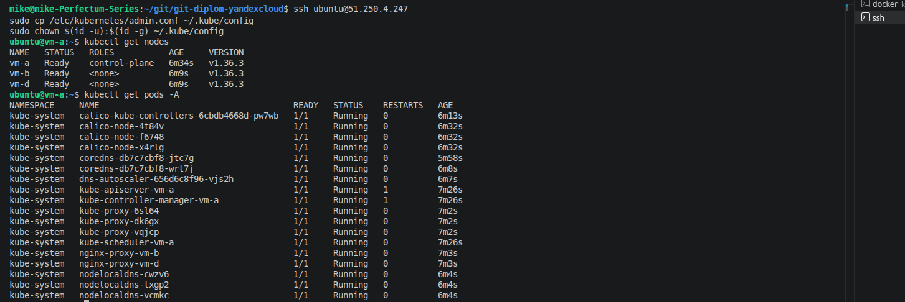

   в. Задеплоить Kubernetes на подготовленные ранее инстансы, в случае нехватки каких-либо ресурсов вы всегда можете создать их при помощи Terraform.
2. Альтернативный вариант: воспользуйтесь сервисом [Yandex Managed Service for Kubernetes](https://cloud.yandex.ru/services/managed-kubernetes)  
  а. С помощью terraform resource для [kubernetes](https://registry.terraform.io/providers/yandex-cloud/yandex/latest/docs/resources/kubernetes_cluster) создать **региональный** мастер kubernetes с размещением нод в разных 3 подсетях      
  б. С помощью terraform resource для [kubernetes node group](https://registry.terraform.io/providers/yandex-cloud/yandex/latest/docs/resources/kubernetes_node_group)
  
Ожидаемый результат:

1. Работоспособный Kubernetes кластер.
2. В файле `~/.kube/config` находятся данные для доступа к кластеру.

`Добавить данные из файла ~/.kube/config из master-node в файл ~/.kube/config на локальной машине`

`Добавление публичного IP в сертификат для подключения к кластеру с локальной машины:`
```
# Проверить текущие SAN в сертификате:
openssl x509 -in /etc/kubernetes/pki/apiserver.crt -text -noout | grep -A 1 "Subject Alternative Name"
```
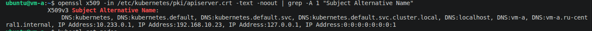
```
# Создать бэкап текущей конфигурации kubeadm
sudo cp /etc/kubernetes/kubeadm-config.yaml /etc/kubernetes/kubeadm-config.yaml.bak

# Отредактировать конфигурацию:
sudo nano /etc/kubernetes/kubeadm-config.yaml

# Добавить адреса мастер-ноды:
apiServer:
  certSANs:
  - "51.250.4.247"
  - "192.168.10.23"
  - "127.0.0.1"
  - "localhost"
  extraArgs:
    authorization-mode: Node,RBAC

# Удалить старый сертификат:
sudo rm /etc/kubernetes/pki/apiserver.crt /etc/kubernetes/pki/apiserver.key

# Создать новый сертификат с обновленной конфигурацией
sudo kubeadm init phase certs apiserver --config=/etc/kubernetes/kubeadm-config.yaml

# Перезапустить kubelet
sudo systemctl restart kubelet

# Проверить, что новый сертификат содержит публичный IP
openssl x509 -in /etc/kubernetes/pki/apiserver.crt -text -noout | grep -A 1 "Subject Alternative Name"

# Скопировать обновленный admin.conf:
sudo cp /etc/kubernetes/admin.conf ~/.kube/config
sudo chown $(id -u):$(id -g) ~/.kube/config

# На локальной машине скопировать обновленный конфиг:
scp -i ~/.ssh/tf_ed25519 ubuntu@51.250.4.247:~/.kube/config ~/.kube/config

# Проверка:
kubectl get nodes
```
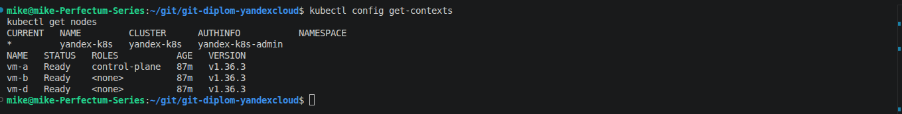

3. Команда `kubectl get pods --all-namespaces` отрабатывает без ошибок.

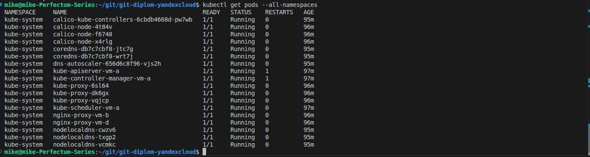
---
### Создание тестового приложения

Для перехода к следующему этапу необходимо подготовить тестовое приложение, эмулирующее основное приложение разрабатываемое вашей компанией.

Способ подготовки:

1. Рекомендуемый вариант:  
   а. Создайте отдельный git репозиторий с простым nginx конфигом, который будет отдавать статические данные.  
   б. Подготовьте Dockerfile для создания образа приложения.  
2. Альтернативный вариант:  
   а. Используйте любой другой код, главное, чтобы был самостоятельно создан Dockerfile.

Ожидаемый результат:

1. Git репозиторий с тестовым приложением и Dockerfile.

[Ссылка на Git-репозиторий с Nginx](https://github.com/bmw81/test-app_for_k8s/blob/main/README.md)

2. Регистри с собранным docker image. В качестве регистри может быть DockerHub или [Yandex Container Registry](https://cloud.yandex.ru/services/container-registry), созданный также с помощью terraform.

[Ссылка на DockerHub-regitry с образом приложения](https://hub.docker.com/repository/docker/bmw81/test-app/general)

`Создание структуры приложения:`
```
mkdir -p ~/git/test-app
cd ~/git/test-app
```
`Создать html-страницу для Nginx:`

[Копия страницы index.html](./index.html)

`Создать Dockerfile для создания образа настроенного Nginx:`

[Копия Dockerfile Nginx](./Dockerfile)

`Сборка образа:`
```
docker build -t test-app:1.0.0 .
```
`Проверка собранного образа:`
```
docker images | grep test-app
```
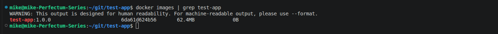
`Тестирование образа локально:`
```
docker run -d -p 8080:80 --name test-app test-app:1.0.0
curl http://localhost:8080
docker stop test-app
docker rm test-app
```
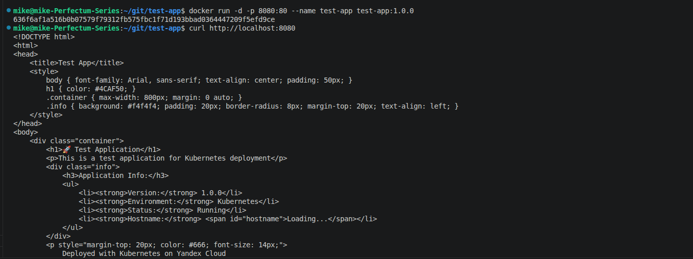
`Подготовка образа для публикации в Dockerhub:`
```
docker tag test-app:1.0.0 bmw81/test-app:1.0.0
docker tag test-app:1.0.0 bmw81/test-app:latest
```
`Вход в Dockerhub:`
```
docker login
```
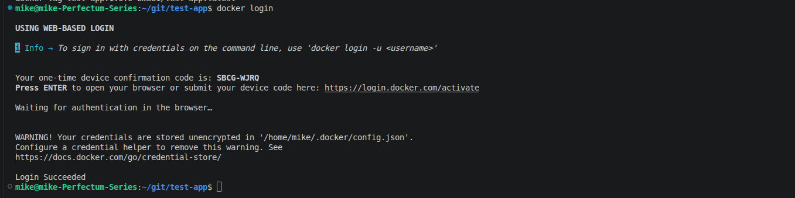
`Push образа Nginx:`
```
docker push bmw81/test-app:1.0.0
docker push bmw81/test-app:latest
```
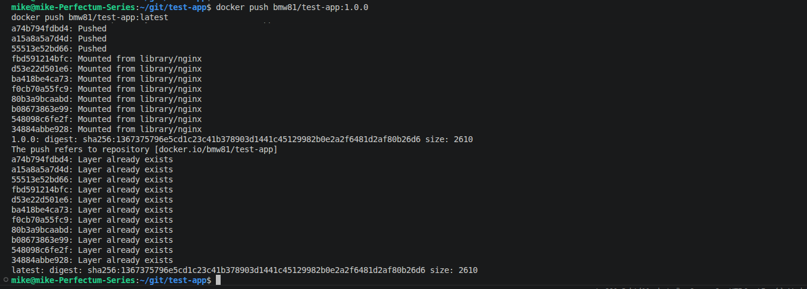
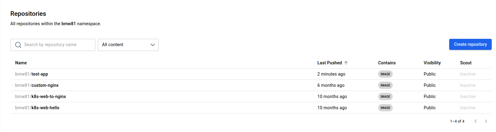

---
### Подготовка cистемы мониторинга и деплой приложения

Уже должны быть готовы конфигурации для автоматического создания облачной инфраструктуры и поднятия Kubernetes кластера.  
Теперь необходимо подготовить конфигурационные файлы для настройки нашего Kubernetes кластера.

Цель:
1. Задеплоить в кластер [prometheus](https://prometheus.io/), [grafana](https://grafana.com/), [alertmanager](https://github.com/prometheus/alertmanager), [экспортер](https://github.com/prometheus/node_exporter) основных метрик Kubernetes.
2. Задеплоить тестовое приложение, например, [nginx](https://www.nginx.com/) сервер отдающий статическую страницу.

Способ выполнения:
1. Воспользоваться пакетом [kube-prometheus](https://github.com/prometheus-operator/kube-prometheus), который уже включает в себя [Kubernetes оператор](https://operatorhub.io/) для [grafana](https://grafana.com/), [prometheus](https://prometheus.io/), [alertmanager](https://github.com/prometheus/alertmanager) и [node_exporter](https://github.com/prometheus/node_exporter). Альтернативный вариант - использовать набор helm чартов от [bitnami](https://github.com/bitnami/charts/tree/main/bitnami).

`Шаг 1: Клонирование репозитория kube-prometheus:`
```
cd ~/git
git clone https://github.com/prometheus-operator/kube-prometheus.git
cd kube-prometheus
```
`Шаг 2: Применение манифестов:`
```
# Создать namespace и CRD(CustomResourceDefinitions):
kubectl apply --server-side -f manifests/setup
```
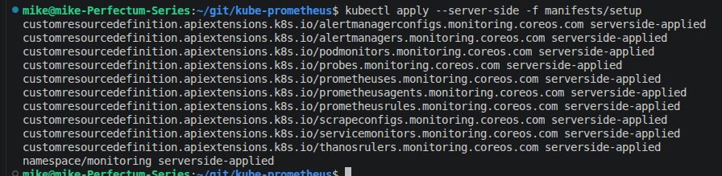
```
# Дождаться создания CRD:
kubectl wait \
    --for condition=Established \
    --all CustomResourceDefinition \
    --namespace=monitoring

# Применить остальные манифесты:
kubectl apply -f manifests/
```

`Проверка установки:`
```
# Проверка подов в namespace monitoring:
kubectl get pods -n monitoring
```
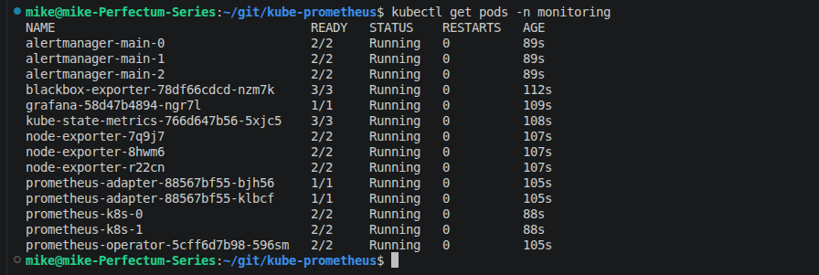
```
# Проверка сервисов мониторинга:
kubectl get svc -n monitoring
```
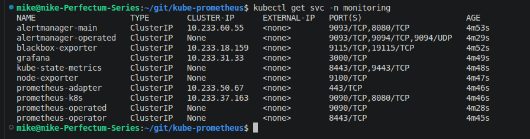
- prometheus-operator (оператор)
- prometheus (сам Prometheus)
- alertmanager (менеджер алертов)
- grafana (дашборды)
- node-exporter (сбор метрик с нод)
- kube-state-metrics (метрики Kubernetes)

`Настройка доступа к веб-интерфейсам Grafana, Prometheus и Alertmanager:`
```
# Использование kubectl port-forward для каждого сервиса. В 3-х терминалах запускаю проброс портов:
kubectl port-forward -n monitoring svc/grafana 3000:3000
kubectl port-forward -n monitoring svc/prometheus-k8s 9090:9090
kubectl port-forward -n monitoring svc/alertmanager-main 9093:9093
```
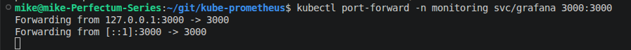
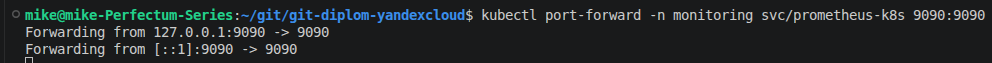
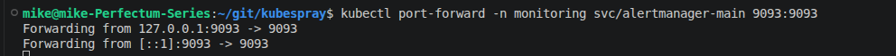

`Деплой тестового приложения:`

[Манифест для деплоя тестового приложения (nginx)](./02-infrastructure/test-app.yaml)

```
# Применить манифест:
kubectl apply -f test-app.yaml
```
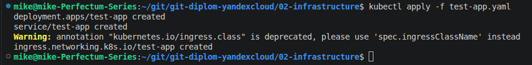
`Проверка деплоя:`
```
# Проверка подов приложения:
kubectl get pods -l app=test-app

# Проверка сервисов:
kubectl get svc test-app
```
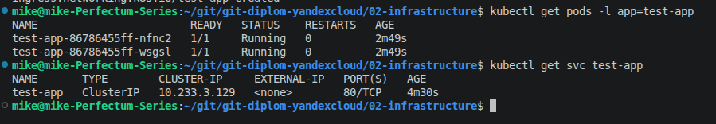

`Получить доступ к приложению:`
```
# Проброс портов:
kubectl port-forward svc/test-app 8080:80

# В браузере:
http://localhost:8080
```

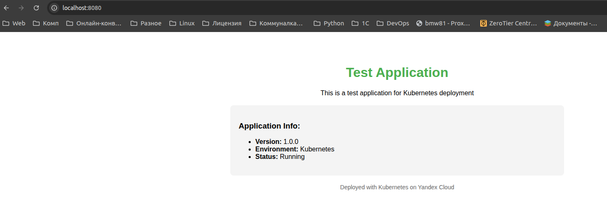

`Настройка мониторинга приложения: нужно настроить сбор метрик с приложения в Prometheus и отображение их в Grafana.`

`Для сбора метрик с Nginx использую nginx-prometheus-exporter — sidecar-контейнер, который собирает метрики с Nginx и отдает их в формате Prometheus. Для этого необходимо в test.yaml добавить соответствующий блок с экспортером и применить обновленный манифест:`
```
kubectl apply -f ~/git/git-diplom-yandexcloud/02-infrastructure/test-app.yaml

# Проверка, чтоо оба контейнера запустились:
kubectl get pods -l app=test-app

# Проверка, что метрики доступны:
kubectl port-forward svc/test-app 9113:9113
```
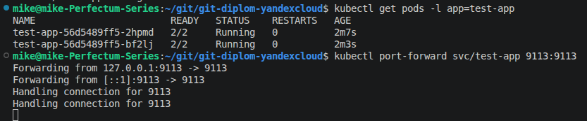
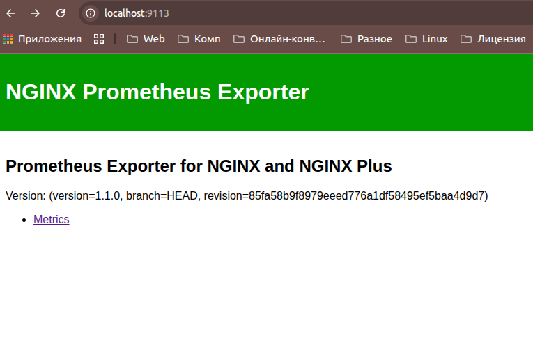

`Создать ServiceMonitor для мониторинга приложения:`

[Манифест по созданию ServiceMonitor](./02-infrastructure/servicemonitor.yaml)

`Запуск манифеста и прверка сервиса:`
```
kubectl apply -f ~/git/git-diplom-yandexcloud/02-infrastructure/servicemonitor.yaml
kubectl get servicemonitor -n monitoring | grep test-app
```
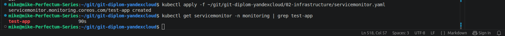

`Настройка сбора метрик в Grafana:`

`В Dockerfile включить модуль сбора метрик Nginx stub_status, пересоздать образ, задеплоить`

`В Grafana:`

- Перейти в Explore - выберать источник данных prometheus
- Ввести запрос: nginx_http_requests_total

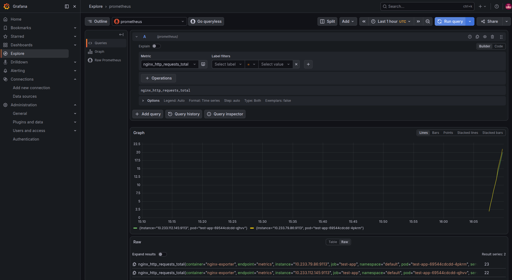

`Создать дашборд для мониторинга Nginx:`
- В левом меню Grafana нажать Dashboard "+"
- New Dashboard
- Auto Grid
- Panel +
- Configure Visualisation
- Выберать источник prometheus
- Metric: nginx_connections_active
- Run queries

`Добавить вторую панель "Запросы в секунду"`

- Add query
- В новом запросе: rate(nginx_http_requests_total[1m])
- Run queries"
- Save

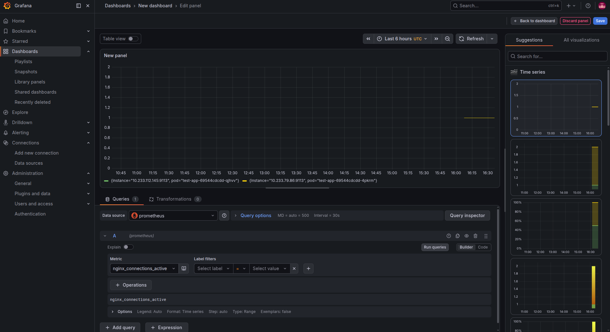

### Деплой инфраструктуры в terraform pipeline

1. Если на первом этапе вы не воспользовались [Terraform Cloud](https://app.terraform.io/), то задеплойте и настройте в кластере [atlantis](https://www.runatlantis.io/) для отслеживания изменений инфраструктуры. Альтернативный вариант 3 задания: вместо Terraform Cloud или atlantis настройте на автоматический запуск и применение конфигурации terraform из вашего git-репозитория в выбранной вами CI-CD системе при любом комите в main ветку. Предоставьте скриншоты работы пайплайна из CI/CD системы.

Ожидаемый результат:
1. Git репозиторий с конфигурационными файлами для настройки Kubernetes.
2. Http доступ на 80 порту к web интерфейсу grafana.
3. Дашборды в grafana отображающие состояние Kubernetes кластера.
4. Http доступ на 80 порту к тестовому приложению.
5. Atlantis или terraform cloud или ci/cd-terraform

`В качестве CI/CD системы я буду использовать GitHub Actions, так как ранее написанный код уже на GitHub. Это бесплатно для публичных репозиториев и идеально подходит для этой задачи`

`Для работы пайплайна Terraform в Яндекс.Облаке ему понадобятся ключи доступа. Вместо того чтобы хранить их в коде, добавлю их как зашифрованные секреты в настройках репозитория на GitHub:`
- На главной странице репозитория - Settings
- Secrets and variables - Actions
- New repository secret

`Нужно добавить 3 секрета (для сервисного аккаунта, access_key и secret_key для S3-бакета):`
- Имя секрета: YC_SERVICE_ACCOUNT_KEY_FILE
- Значение: Содержимое файла с ключом сервисного аккаунта, который использовался для Terraform (~/.authorized_key.json). Весь JSON-объект.

- Имя секрета: YC_S3_ACCESS_KEY
- Значение: access_key для S3-бакета, который хранит состояние Terraform

- Имя секрета: YC_S3_SECRET_KEY
- Значение: Ваш secret_key для S3-бакета.

`Также необходимо добавить логин и токен доступа к DockerHub:`
- Зайти на https://hub.docker.com/settings/security
- Personal access token
- Generate new token
- Имя: github-actions - Generate
- Полученный токен добавить в Github Actions как значение с именем DOCKERHUB_TOKEN
- Добавить в Github Actions секрет DOCKERHUB_USERNAME со значением: логин в DockerHub

`Добавить секрет KUBECONFIG (содержимое ~/.kube/config с мастер-ноды) в Github Actions для доступа к Kubernetes-кластеру и SSH_PUBLIC_KEY`

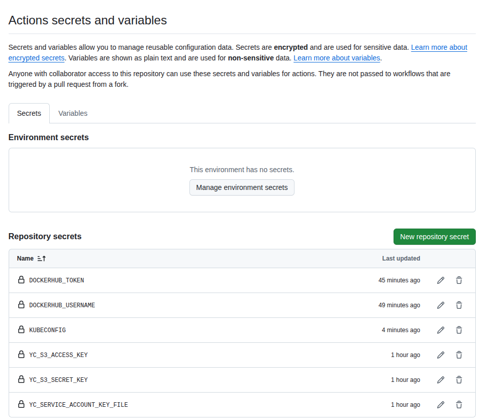


`Создать манифест для terraform-pipeline:`
```
cd ~/git/git-diplom-yandexcloud
mkdir -p .github/workflows
nano .github/workflows/terraform.yml
```
`Манифест находится в папке .github/workflows. Важно импортировать все существующие ресурсы с их id (сеть, подсети, security groups, ВМ, NAT-инстанс, таблицу маршрутизации)`

`Проверка:`
```
git add .
git commit -m "Make some changes in files"
git push origin main
```

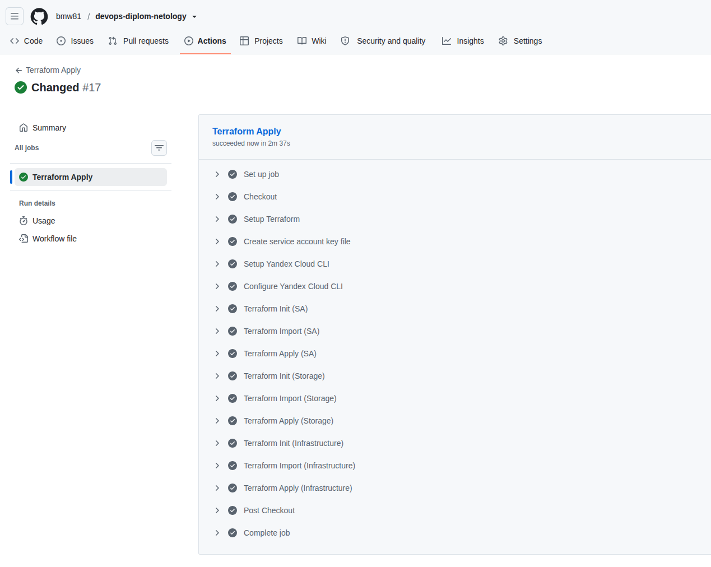

---
### Установка и настройка CI/CD

Осталось настроить ci/cd систему для автоматической сборки docker image и деплоя приложения при изменении кода.

Цель:

1. Автоматическая сборка docker образа при коммите в репозиторий с тестовым приложением.
2. Автоматический деплой нового docker образа.

Можно использовать [teamcity](https://www.jetbrains.com/ru-ru/teamcity/), [jenkins](https://www.jenkins.io/), [GitLab CI](https://about.gitlab.com/stages-devops-lifecycle/continuous-integration/) или GitHub Actions.

Ожидаемый результат:

1. Интерфейс ci/cd сервиса доступен по http.
2. При любом коммите в репозиторие с тестовым приложением происходит сборка и отправка в регистр Docker образа.
3. При создании тега (например, v1.0.0) происходит сборка и отправка с соответствующим label в регистри, а также деплой соответствующего Docker образа в кластер Kubernetes.

`Создать workflow для приложения:`
```
nano ~/git/git-diplom-yandexcloud/.github/workflows/deploy-app.yml
```
`Добавить в GitHub переменные DOCKERHUB_USERNAME, DOCKERHUB_TOKEN, KUBECONFIG`

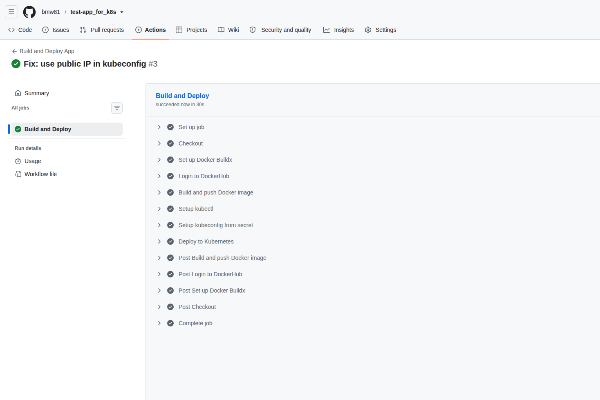

---
## Что необходимо для сдачи задания?

1. Репозиторий с конфигурационными файлами Terraform и готовность продемонстрировать создание всех ресурсов с нуля.
2. Пример pull request с комментариями созданными atlantis'ом или снимки экрана из Terraform Cloud или вашего CI-CD-terraform pipeline.
3. Репозиторий с конфигурацией ansible, если был выбран способ создания Kubernetes кластера при помощи ansible.
4. Репозиторий с Dockerfile тестового приложения и ссылка на собранный docker image.
5. Репозиторий с конфигурацией Kubernetes кластера.
6. Ссылка на тестовое приложение и веб интерфейс Grafana с данными доступа.
7. Все репозитории рекомендуется хранить на одном ресурсе (github, gitlab)
